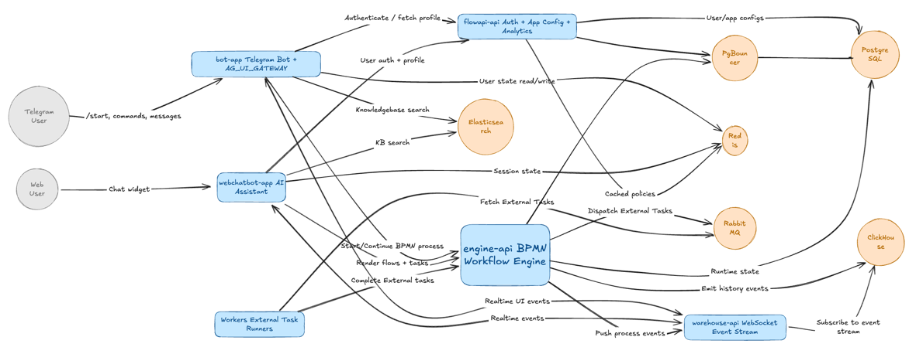

# Components Guide




---

## Stateless Components

### bot-app

**Type:** Kubernetes Deployment (stateless, horizontally scalable)

**Purpose:** Telegram bot with integrated AG-UI Gateway

**Technology Stack:**
- Python (Telegram Bot API)
- AG-UI Gateway (SSE API, forms, tools)
- Redis client
- Elasticsearch client
- HTTP clients (FlowAPI, EngineAPI, warehouse-api)

**Key Features:**
- Telegram message handling and routing
- Onboarding flows
- Knowledge base search (Elasticsearch RAG)
- BPMN form rendering (from Camunda engine)
- Inline keyboards, reply buttons, suggestions
- Wallet integration (Solana)
- Quest progress tracking

**Connections:**
- **Redis** — User state and session management
- **FlowAPI** — Authentication and app configuration
- **EngineAPI** — BPMN workflow orchestration
- **Elasticsearch** — Knowledge base RAG queries
- **warehouse-api** — Real-time event notifications (WebSocket)

**Configuration:**
```yaml
env:
  - TELEGRAM_BOT_TOKEN
  - REDIS_URL
  - FLOWAPI_URL
  - ENGINEAPI_URL
  - ELASTICSEARCH_URL
  - WAREHOUSE_API_URL
  - CAMUNDA_ENABLED  # true/false
```

**Scaling:** Horizontally scalable via HPA (Horizontal Pod Autoscaler)

---

### webchatbot-app

**Type:** Kubernetes Deployment (stateless, horizontally scalable)

**Purpose:** Intercom-style AI chat widget for web

**Technology Stack:**
- Next.js (React)
- CopilotKit (AG-UI Protocol)
- AG-UI Gateway client (SSE API)
- Redis client

**Key Features:**
- Embeddable chat interface (AG-UI compatible)
- Real-time responses via AG-UI Gateway
- Forms and tool execution
- Shared context with Telegram bot

**Connections:**
- **AG-UI Gateway** (within bot-app) — Unified backend
- **Redis** — Session management

**Configuration:**
```yaml
env:
  - AG_UI_GATEWAY_URL
  - REDIS_URL
```

**Scaling:** Horizontally scalable via HPA

---

### engine-api

**Type:** Kubernetes Deployment (stateless, horizontally scalable)

**Purpose:** BPMN workflow engine (Camunda 7)

**Technology Stack:**
- Java (Camunda 7)
- PostgreSQL client (via PgBouncer)
- ClickHouse client
- RabbitMQ client

**Key Features:**
- Executes BPMN workflows
- Visual workflows (BPMN diagrams or text/YAML)
- Forms engine (generated or Camunda forms)
- Task lists (user, LLM, automated actions)
- External tasks (dispatched via RabbitMQ)
- Event-driven triggers

**Data Storage:**
- **PostgreSQL** (via PgBouncer) — Runtime state and process definitions
- **ClickHouse** — Historical events and analytics

**API Endpoints:**
- `POST /process-definition/{id}/start` — Start process instance
- `POST /task/{id}/complete` — Complete user task
- `GET /task` — Query task list
- `GET /process-definition` — Get process definitions
- `POST /deployment/create` — Deploy workflow

**Configuration:**
```yaml
env:
  - POSTGRES_URL  # via PgBouncer
  - CLICKHOUSE_URL
  - RABBITMQ_URL
```

**Scaling:** Horizontally scalable via HPA

---

### flowapi-api

**Type:** Kubernetes Deployment (stateless, horizontally scalable)

**Purpose:** Authentication, app configuration, and analytics API

**Technology Stack:**
- Node.js / Python
- PostgreSQL client (via PgBouncer)
- Redis client
- JWT library

**Key Features:**
- Auth layer (JWT-based)
- Application configurations
- Analytics API
- User management

**Data Storage:**
- **PostgreSQL** (via PgBouncer) — Users, apps, configurations
- **Redis** — Cache and session data

**API Endpoints:**
- `POST /auth/login` — User authentication
- `GET /apps/{id}/config` — Get app configuration
- `GET /analytics/engagement` — Engagement metrics
- `GET /users/{id}` — User profile

**Configuration:**
```yaml
env:
  - POSTGRES_URL  # via PgBouncer
  - REDIS_URL
  - JWT_SECRET
```

**Scaling:** Horizontally scalable via HPA

---

### warehouse-api

**Type:** Kubernetes Deployment (stateless, horizontally scalable)

**Purpose:** Event warehouse and real-time notifications

**Technology Stack:**
- Node.js / Python
- WebSocket server
- ClickHouse client

**Features:**
- WebSocket interface for real-time events
- Pushes updates to clients from engine events
- Historical event storage (ClickHouse)
- Analytics queries (event aggregation, dashboards)

**WebSocket Events:**
- `task.created` — New task available
- `task.completed` — Task completed
- `process.started` — Process instance started
- `process.completed` — Process instance completed

**Configuration:**
```yaml
env:
  - CLICKHOUSE_URL
  - ENGINE_API_URL
```

**Scaling:** Horizontally scalable via HPA

---

### Workers

**Type:** Kubernetes Deployment (stateless, horizontally scalable)

**Purpose:** Async workload processing

**Technology Stack:**
- Python / Node.js
- RabbitMQ client
- Various tool integrations (LLM, image processing, etc.)

**Features:**
- External task workers (RabbitMQ consumers)
- Off-chain computation
- LLM tasks
- Long-running async actions
- Workflow integrations

**Worker Types:**
- **LLM Workers** — Process LLM requests
- **Image Workers** — Image processing, OCR, generation
- **Whisper Workers** — Voice transcription
- **On-chain Workers** — Solana blockchain lookups
- **Custom Workers** — Project-specific integrations

**Configuration:**
```yaml
env:
  - RABBITMQ_URL
  - WORKER_TYPE  # llm, image, whisper, onchain, custom
  - TOOL_CONFIGS
```

**Scaling:** Horizontally scalable via HPA

---

## Stateful Components

### PostgreSQL

**Type:** Kubernetes StatefulSet

**Purpose:** Primary database for runtime state and configurations

**Used By:**
- `engine-api` → BPMN runtime state and process definitions
- `flowapi-api` → Users, apps, auth, configurations

**Access:** Exclusively via PgBouncer for connection pooling

**Scaling:**
- Vertical scaling (CPU, memory)
- HA setup (primary + replicas)

**Backup:** pgBackRest

**Configuration:**
```yaml
resources:
  requests:
    cpu: 2
    memory: 4Gi
  limits:
    cpu: 4
    memory: 8Gi
```

---

### ClickHouse

**Type:** Kubernetes StatefulSet

**Purpose:** Event bus and analytics storage

**Stores:**
- Engine events (from Camunda)
- FlowAPI analytics
- Engagement metrics
- Quest/event logs

**Scaling:** Shards + replicas

**Backup:** ClickHouse backups

**Configuration:**
```yaml
replicas: 3
shards: 2
```

---

### Redis

**Type:** Kubernetes StatefulSet

**Purpose:** Cache and state machine

**Used By:**
- `bot-app` — User state and session management
- `flowapi-api` — Cache for app configs and user data
- `webchatbot-app` — Session management

**Scaling:**
- Redis Sentinel (HA)
- Redis Cluster (horizontal scaling)

**Backup:** Optional snapshots (ephemeral data)

**Configuration:**
```yaml
mode: sentinel  # or cluster
replicas: 3
```

---

### RabbitMQ

**Type:** Kubernetes StatefulSet

**Purpose:** Message queue for async processing

**Handles:**
- External tasks (from Camunda engine)
- LLM jobs
- Long-running async actions
- Workflow integrations

**Scaling:** Quorum queues

**Backup:** Queue definitions backup

**Configuration:**
```yaml
queue_type: quorum
replicas: 3
```

---

### Elasticsearch

**Type:** Kubernetes StatefulSet

**Purpose:** Knowledge base search (Dynamic RAG)

**Used By:**
- `bot-app` — Knowledge base search for Telegram bot
- `AG-UI Gateway` (within bot-app) — Knowledge base search for webchatbot

**Scaling:** Multi-node cluster

**Backup:** ES snapshots

**Configuration:**
```yaml
replicas: 3
storage: 100Gi
```

---

## Component Interactions

### Request Flow Example

1. **User sends message to Telegram bot**
   - `bot-app` receives via Telegram Bot API

2. **bot-app checks Redis for user state**
   - Retrieves session and context

3. **bot-app authenticates via FlowAPI**
   - JWT token validation

4. **bot-app queries Elasticsearch for RAG**
   - Knowledge base search

5. **bot-app starts workflow via EngineAPI**
   - BPMN process instance

6. **EngineAPI writes to PostgreSQL**
   - Runtime state stored

7. **EngineAPI emits events to ClickHouse**
   - Analytics events logged

8. **EngineAPI dispatches external task to RabbitMQ**
   - Async processing

9. **Worker consumes task from RabbitMQ**
   - Processes async action

10. **warehouse-api pushes WebSocket event**
    - Real-time notification to bot/webchatbot

---

## Configuration Management

### Environment Variables

Each component uses environment variables for configuration:

- **Database URLs** — PostgreSQL, ClickHouse, Redis, Elasticsearch
- **Service URLs** — FlowAPI, EngineAPI, warehouse-api
- **Secrets** — JWT secrets, API keys, tokens
- **Feature Flags** — `CAMUNDA_ENABLED`, `RAG_ENABLED`, etc.

### Secrets Management

- **Vault** — Enterprise secret management
- **Kubernetes Secrets** — Standard K8s secret storage
- **Launcher Wizard** — Generates and injects secrets

---

## Monitoring & Observability

### Health Checks

- **Liveness probes** — Component health
- **Readiness probes** — Service availability
- **Startup probes** — Initialization status

### Metrics

- **Prometheus** — Metrics collection
- **Grafana** — Dashboards and visualization

### Logging

- **Centralized logging** — All components log to centralized system
- **Structured logs** — JSON format for parsing

---

## Next Steps

- Read the [Architecture Overview](architecture.md) for system-level understanding
- Check the [Requirements](requirements.md) for deployment requirements
- Learn about the [Launcher Wizard](launcher-wizard.md) for automated deployment

