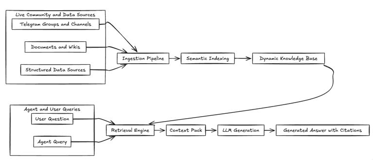
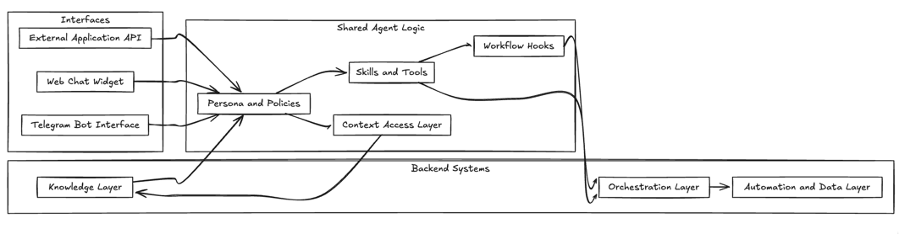
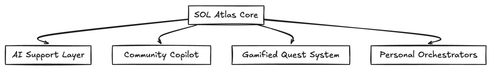
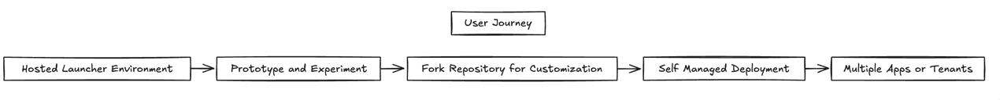

# SOL Atlas: An Open Framework for AI-Driven Community Platforms and Personal Agents

**Version 0.1 — Draft Whitepaper**

---

## Abstract

SOL Atlas is an open-source framework for building **AI-native communities** and **personal agents** that operate across chat interfaces, web portals, and automated workflows. It unifies three historically separate domains:

- **Conversational agents** (chatbots, copilots, assistants)
- **Knowledge systems** (documentation, community archives, operational memory)
- **Business workflows** (onboarding, support, tasks, gamified engagement)

Atlas is designed as an **orchestration layer** rather than a single application. It enables communities, teams, and product builders to compose:

- **Dynamic knowledge bases** that update themselves from live conversation streams
- **Agentic workflows** that blend deterministic logic with LLM-powered reasoning
- **Multi-interface assistants** that share context across Telegram, web, and APIs
- **Gamified engagement systems** that transform passive audiences into active ecosystems

By combining battle-tested workflow automation with modern AI and streaming data, SOL Atlas aims to bridge the gap between simple chatbots and enterprise-grade automation platforms, while remaining fully open source, self-hostable, and portable.

---

## 1. Introduction

### 1.1 The State of AI Assistants Today

AI assistants have become pervasive, but the majority fall into one of three categories:

- **Isolated chatbots** — Single-channel agents (often a Telegram bot or a website widget) that answer questions but lack memory, workflows, or deep integration with the organization’s processes.
- **Monolithic enterprise platforms** — Complex, expensive systems that require significant integration effort and lock users into closed ecosystems.
- **Fragmented tooling** — Separate services for chat, CRM, documentation, support, and automation, each with its own data silos and configuration.

Communities and organizations that want to move beyond simple FAQ bots must often assemble a patchwork of tools: one for ticketing, one for analytics, another for forums, and yet another for gamification. AI is added later as a thin layer on top, rather than being part of the system’s core design.

### 1.2 The Opportunity: AI-Native Communities

Modern communities—crypto, open source, enterprise, gaming, local initiatives—produce a continuous stream of high-value knowledge:

- Support conversations
- Governance and decision-making threads
- Tutorials and best practices
- Feedback loops and product insights

Most of this knowledge is **ephemeral**. It lives in chat logs and is quickly forgotten.

AI introduces the possibility of turning these streams into **living knowledge systems** and building **agents** that understand the community’s context, language, and norms.

However, to realize this potential, we need infrastructure that:

- Treats chat, knowledge, and workflows as **one system**.
- Supports **long-lived context** and **continuous learning** from live data.
- Is **programmable and composable**, not a closed black box.
- Can be operated by a broad range of builders—from solo developers to large organizations.

SOL Atlas is proposed as such an infrastructure.

---

## 2. Vision and Design Principles

### 2.1 Vision

SOL Atlas aims to be the **open, programmable substrate** for AI-driven communities and personal agents. It is not a single product, but a framework and reference implementation that enables others to build:

- AI support copilots
- Community governance assistants
- Gamified quest systems
- Knowledge-driven research agents
- Personal orchestrators for tasks and workflows

The core vision is **orchestration over replacement**: humans, agents, workflows, and data collaborate in a shared environment where each is good at what it does best.

### 2.2 Design Principles

1. **Composability**  
   Atlas is built as a modular system. Interfaces, workflows, tools, and knowledge sources can be introduced, upgraded, or replaced without rewriting the entire stack.

2. **Orchestration First**  
   Instead of hiding complexity behind a single “magic” prompt, Atlas encourages explicit workflows. Deterministic steps (forms, approvals, tasks) are orchestrated alongside generative steps (LLM reasoning, summarization, content generation).

3. **Context Continuity**  
   Agents are not one-off sessions. They operate with memory: user history, community archives, workflow state, and external data sources are unified into long-lived context.

4. **Dynamic Knowledge**  
   Knowledge bases are treated as **processes**, not static documents. They are updated continuously from message streams, documents, and event feeds.

5. **Multi-Interface Presence**  
   The same agent logic can appear in Telegram, on the web, and via APIs. Context and state are shared, so users can move between interfaces without losing continuity.

6. **Portability and Sovereignty**  
   Atlas is fully open source and self-hostable. Communities retain control over their data and infrastructure. The framework is designed for both cloud-native and self-managed deployments.

7. **Ecosystem-Friendly**  
   Atlas is built to integrate with existing tools rather than replace them: analytics platforms, CRMs, blockchain networks, and external APIs can be connected as tools and data sources.

---

## 3. System Model

Rather than focusing on implementation details, the SOL Atlas architecture can be understood through a set of conceptual layers.

### 3.1 Interface Layer

The Interface Layer exposes Atlas capabilities to users and other systems. It includes:

- **Chat interfaces** — e.g., Telegram bots, other messaging platforms, and web-based chat widgets.
- **Web portals** — dashboards, admin panels, and community hubs.
- **APIs** — programmatic access for integrating Atlas agents into existing products.

All interfaces share a **common session and context model**, allowing a user to, for example, start a process in a Telegram chat and complete it in a web portal without losing continuity.

### 3.2 Orchestration Layer

The Orchestration Layer coordinates **workflows**, **tasks**, and **agent behavior**. It is responsible for:

- Modeling business processes and community flows (onboarding, support, quests, submissions, etc.).
- Coordinating human tasks, automated tools, and LLM-based reasoning.
- Managing long-running processes and asynchronous execution.

This layer uses a **declarative workflow model** (BPMN-style process definitions) to ensure that agentic behavior is transparent, testable, and version-controlled.

### 3.3 Knowledge Layer

The Knowledge Layer manages **collective memory**. It ingests and organizes information from:

- Community message streams (e.g., Telegram groups and channels)
- Documentation and knowledge bases
- Logs, digests, and structured datasets

Key capabilities include:

- **Dynamic RAG (Retrieval-Augmented Generation)**  
  Knowledge bases are continuously updated from live data, enabling agents to answer questions with up-to-date context and cited sources.

- **Multi-domain knowledge**  
  General knowledge, community-specific history, and high-frequency data (e.g., tokens, points, entities) can coexist in different indices while being accessible to the same agents.

### 3.4 Agent Layer

The Agent Layer defines how individual agents behave, including:

- **Personas** — goals, tone, and operating guidelines for each agent.
- **Skills and tools** — functions that the agent can invoke (search, write, call external APIs, update workflows, etc.).
- **Context policies** — what kinds of information the agent can access and under what constraints.

Agents in Atlas are not defined solely by prompts. They are described by a combination of:

- Natural language instructions
- Configuration metadata (skills, tools, rules)
- Connection to workflows and knowledge sources

This enables **consistent, inspectable behavior** that can be versioned, tested, and adapted for different communities and environments.

### 3.5 Automation & Data Layer

The Automation & Data Layer underpins the execution of workflows and the storage/processing of events. It includes:

- Durable storage for workflow state and configuration.
- High-throughput event storage for historical analysis and dashboards.
- Messaging and background processing for long-running or asynchronous tasks.

This layer enables use cases such as:

- Automated digests ("what you missed" recaps).
- Long-running quests and campaigns.
- Real-time notifications and analytics dashboards.

---

## 4. Core Innovations

### 4.1 Dynamic RAG: Self-Updating Knowledge Bases

Traditional RAG setups often rely on manually curated datasets and infrequent re-indexing. In contrast, Atlas is designed around **Dynamic RAG**:

- **Continuous ingestion** of messages and documents from community channels.
- **Semantic indexing** that supports both keyword and vector search.
- **Freshness-aware retrieval**, prioritizing recent, high-signal information when relevant.
- **Transparent attribution**, allowing agents to cite their sources in responses.

This enables:

- Assistants that can answer questions based on the actual history of a community’s conversations.
- Digest generation that highlights key decisions, ideas, and updates.
- Mixed knowledge bases that include both narrative content (discussions) and structured data (tokens, points, items).

### 4.2 Agentic Workflows

Many AI assistants break down when they must handle multi-step processes, conditional logic, or coordination between humans and systems. Atlas addresses this with **Agentic Workflows**.

Key characteristics:

- Workflows are modeled explicitly as processes (e.g., BPMN-style diagrams or declarative definitions).
- Deterministic steps (forms, approvals, branching logic) are combined with LLM-powered steps (summaries, suggestions, creativity).
- Agents can:
  - Start workflows based on user intent.
  - Guide users through steps using conversational interfaces.
  - Call tools and external services at the right time.
  - Escalate to humans when needed.

This creates predictable, traceable behavior while still leveraging the flexibility of language models.

### 4.3 Multi-Interface Agents

Atlas is designed from the ground up for **multi-interface operation**. A single agent can:

- Respond to users in Telegram or other chat environments.
- Appear as an embedded web assistant on a landing page or dashboard.
- Operate via API integration inside an existing application.

All interfaces share:

- The same persona definition.
- The same access to workflows.
- The same access to knowledge and tools.

This ensures that support, onboarding, and engagement logic is **consistent** regardless of where the user interacts with the system.

### 4.4 Gamification and Engagement Framework

Communities often struggle to measure and reward participation. Atlas introduces an optional **engagement layer** that supports:

- Quests and missions defined as workflows.
- Leaderboards and scoring models for participation.
- Achievements, badges, and social recognition.
- Wallet-based or account-based gating of actions and rewards.

While the specific economic or token models are left to each community to define, Atlas provides the **mechanics and infrastructure** for engagement-driven design.

---

## 5. Representative Use Cases

Atlas is designed as a general framework, but several use cases illustrate its capabilities.

### 5.1 AI Support Layer for Products and Protocols

A product team can run Atlas as an **open-source alternative to traditional support platforms**:

- An AI assistant embedded on the website answers common questions using dynamic RAG over documentation and community history.
- The same assistant is present in the Telegram support group.
- Complex issues are escalated to human maintainers, with full conversation context preserved.
- Over time, resolved issues feed back into the knowledge base, making future responses better.

### 5.2 Community Copilot for Governance and Knowledge

A DAO or community can deploy Atlas as a **governance and knowledge copilot**:

- The agent summarizes long discussions and proposals.
- Members can ask “What has been decided about X?” and receive answers with citations.
- Governance workflows (proposals, voting preparation, feedback collection) are orchestrated through conversations and forms.
- Weekly digests keep members updated without requiring them to read every message.

### 5.3 Gamified Ecosystems and Quests

Growth-focused communities or campaigns can use Atlas to run **structured quest programs**:

- Quests are defined as workflows with clear conditions and rewards.
- Participants complete actions across chat, web, or external tools.
- The system tracks progress, issues badges, updates leaderboards, and can integrate with token or points systems.
- The agent guides users through quests, explains requirements, and helps troubleshoot.

### 5.4 Personal Orchestrators

Developers and power users can fork Atlas to create **personal agents** that:

- Manage recurring tasks and reminders.
- Interact with APIs, tools, or custom scripts.
- Maintain a personal knowledge base of notes, documents, and messages.
- Interface simultaneously via chat and web dashboards.

In all cases, the underlying architecture and patterns remain the same; only configurations, workflows, and integration endpoints differ.

---

## 6. Deployment and Portability Model

Atlas is intended to run in **modern cloud-native environments** while remaining portable across infrastructures. The reference implementation uses container orchestration and a set of distributed components for:

- Workflow and task orchestration
- Knowledge indexing and search
- State and session management
- Event storage and analytics
- Background processing

Key properties of the deployment model:

- **Namespace isolation** — Different applications or tenants can be isolated at the infrastructure level.
- **Horizontal scalability** — Interface and worker components can be scaled based on load.
- **Pluggable storage and messaging** — Underlying databases, queues, and search backends can be swapped or reconfigured, as long as they satisfy interface contracts.
- **Local and remote development** — Developers can connect local components to a running Atlas deployment, facilitating iterative development and experimentation.

The framework is designed so that builders can start with a **hosted launcher** (for experimentation and quick proof-of-concepts) and later migrate to **self-managed infrastructure** under their own control.

---

## 7. Roadmap

Atlas is evolving from a framework powering internal and early adopter deployments into a broader ecosystem.

### 7.1 Near-Term Objectives (v1)

- Stabilization of core orchestration and knowledge layers.
- Standardized schemas for community events, quests, and engagement signals.
- Improved observability and analytics for workflows and agents.
- Reference templates for common scenarios (support bot, quest system, governance copilot, personal agent).

### 7.2 Medium-Term Objectives (v2)

- Multi-agent coordination patterns (teams of agents with specialized roles).
- Richer tool and integration ecosystem (including MCP/A2A-style protocols).
- Enhanced governance over agents: policies, review flows, and auditing.
- Expanded cross-community features enabling shared knowledge and network effects between Atlas deployments.

### 7.3 Long-Term Direction

- Position Atlas as a foundational layer for **AI-native communities**, where each community can:

  - Own its infrastructure and data.
  - Define its own engagement logic and governance.
  - Compose agents and workflows from a shared pool of open-source components.

- Foster a **builder ecosystem** around Atlas, with reusable templates, modules, and integration packs.

---

## 8. Conclusion

SOL Atlas proposes an open, orchestrated approach to AI-driven communities and personal agents. Instead of isolated chatbots or monolithic platforms, it offers a **framework** for building systems where:

- Knowledge is dynamic and continuously updated.
- Agents are configurable, inspectable, and anchored in workflows.
- Communities own their infrastructure, data, and engagement mechanisms.
- Human and machine capabilities are composed, not conflated.

By unifying interfaces, workflows, knowledge, and automation into a coherent model, Atlas aims to make **AI-native communities** not just possible, but practical and accessible to builders of all scales.

The next phase of the project focuses on hardening the reference implementation, expanding the ecosystem of templates and integrations, and collaborating with early adopters who want to shape the future of AI-powered community infrastructure.

---

**SOL Atlas is built on top of battle-tested components and shared experience in running AI + Web3 automation systems, but it is intentionally presented here as a framework rather than a finished product. Its evolution will be driven by the communities and builders who choose to adopt and extend it.**
